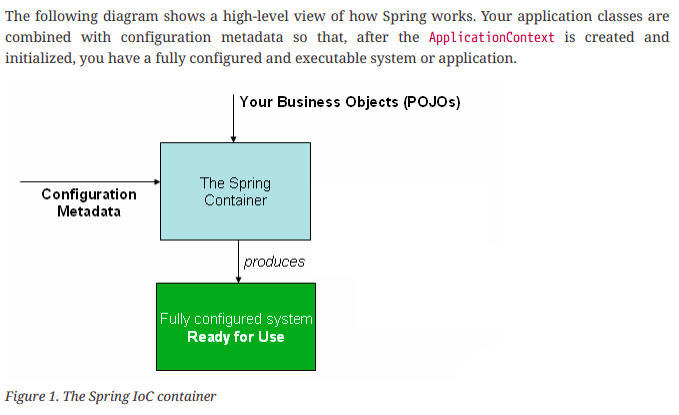
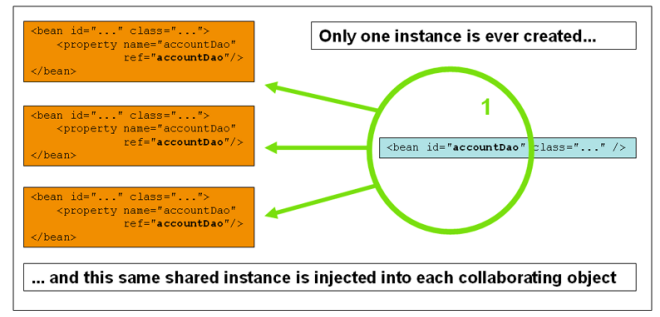
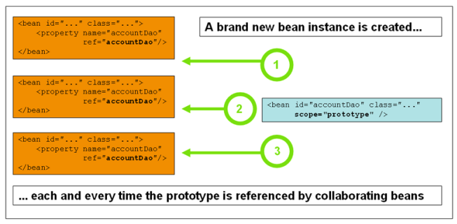
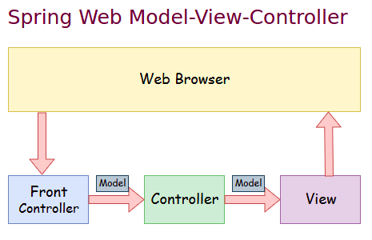
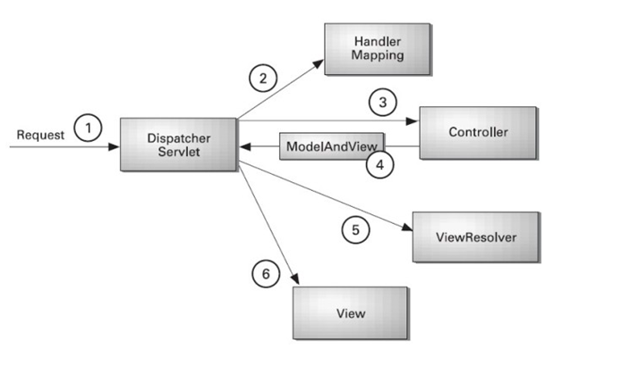

# Spring Framework Tutorial

### Why Frameworks?

* Transaction Management
* Security
* Loose Coupling
* Dependency Injection
* Support
* Expense
* Efficiency

Developing a web application without framework using java servlets.

#### Popular Java Frameworks

* Spring
* Hibernate
* JSF
* GWT
* Struts
* Blade
* Play
* Vaadin
* Grails
* DropWizard

### Why Spring?

* lightweight
* Spring is everywhere 
* Spring is flexible
* Spring is productive
* Spring is fast
* Spring is secure
* Spring is supportive
* Loose Coupling - DI and IOC
* Focus on business functionality leave Spring to manage NFR and infra.

#### Loose Coupling

**Take a look at the demo module rtp-loose-coupling.**


#### Light weight

Spring, is lightweight because it allows minimally invasive development with POJOs. A lightweight framework makes itself as invisible as possible. One of the ways it does this is by encouraging POJO-oriented development.
As others have already pointed out, Spring is considered lightweight compared to traditional Java EE applications. That is precisely the argument for Spring being heavyweight. Modern applications have to do a lot of stuff in order to be competitive. If your app isn’t doing that stuff in your code, then that means the framework is. The more that the framework is doing stuff for you, the more heavyweight it is.

Those Java EE applications used to be deployed to heavyweight application servers (WebSphere, WebLogic, etc.), whereas Spring could be deployed to a lightweight web container like Tomcat or Jetty.

#### IOC

The **org.springframework.beans** and **org.springframework.context** packages are the basis for Spring
Framework’s IoC container. The **BeanFactory** interface provides an advanced configuration
mechanism capable of managing any type of object. **ApplicationContext** is a sub-interface of
BeanFactory. It adds:

* Easier integration with Spring’s AOP features 
* Message resource handling (for use in internationalization)
* Event publication 
* Application-layer specific contexts such as the **WebApplicationContext** for use in web
applications.

In short, the BeanFactory provides the configuration framework and basic functionality, and the
ApplicationContext adds more enterprise-specific functionality. The ApplicationContext is a
complete superset of the BeanFactory and is used exclusively in this chapter in descriptions of
Spring’s IoC container. For more information on using the BeanFactory instead of the
ApplicationContext, see The BeanFactory.
In Spring, the objects that form the backbone of your application and that are managed by the
Spring IoC container are called beans. A bean is an object that is instantiated, assembled, and
managed by a Spring IoC container. Otherwise, a bean is simply one of many objects in your
application. Beans, and the dependencies among them, are reflected in the configuration metadata
used by a container.



#### Container

* Taking requests from Web Server and mapping them to appropriate web components. 
* Managing the whole life cycle of server-side web components like servlet, JSP components. 
* Sending client-side web components code when requested. 
* Executing server-side web components code when requested. 
* Provides a special garbage collector for destroying objects. (ServletContainer will not use JVM’s garbage collector, it will use its own garbage collector). 
* Takes care of intercommunication between web components. One web component communicates with another web component and this task is taken care by the web container. 
* Gives the output/results for server-side web components to Web Server. 
* Applying configured middleware services on web components of web applications and e.t.c.

**Take a look at the demo module spring-ioc**

#### Beans and Scopes

##### Singleton

Only one shared instance of a singleton bean is managed, and all requests for beans with an ID or
IDs that match that bean definition result in that one specific bean instance being returned by the
Spring container.
To put it another way, when you define a bean definition and it is scoped as a singleton, the Spring
IoC container creates exactly one instance of the object defined by that bean definition. This single
instance is stored in a cache of such singleton beans, and all subsequent requests and references
for that named bean return the cached object. The following image shows how the singleton scope
works:



##### Prototype

The non-singleton prototype scope of bean deployment results in the creation of a new bean
instance every time a request for that specific bean is made. That is, the bean is injected into
another bean or you request it through a getBean() method call on the container. As a rule, you
should use the prototype scope for all stateful beans and the singleton scope for stateless beans.
The following diagram illustrates the Spring prototype scope:



##### Request

Consider the following XML configuration for a bean definition:
```java
<bean id="loginAction" class="com.something.LoginAction" scope="request"/>
```
The Spring container creates a new instance of the LoginAction bean by using the loginAction bean
definition for each and every HTTP request. That is, the loginAction bean is scoped at the HTTP
request level. You can change the internal state of the instance that is created as much as you want,
because other instances created from the same loginAction bean definition do not see these
changes in state. They are particular to an individual request. When the request completes
processing, the bean that is scoped to the request is discarded.

##### Session

Consider the following XML configuration for a bean definition:
```java
<bean id="userPreferences" class="com.something.UserPreferences" scope="session"/>
```
The Spring container creates a new instance of the UserPreferences bean by using the
userPreferences bean definition for the lifetime of a single HTTP Session. In other words, the
userPreferences bean is effectively scoped at the HTTP Session level. As with request-scoped beans,
you can change the internal state of the instance that is created as much as you want, knowing that
other HTTP Session instances that are also using instances created from the same userPreferences
bean definition do not see these changes in state, because they are particular to an individual HTTP
Session. When the HTTP Session is eventually discarded, the bean that is scoped to that particular
HTTP Session is also discarded.

#### DI

* Setter based
* Constructor based

**Follow the demo module spring-DI**

#### AutoWiring

##### byName

Autowiring by property name. Spring looks for a bean with the same name as
the property that needs to be autowired. For example, if a bean definition is
set to autowire by name and it contains a master property (that is, it has a
setMaster(..) method), Spring looks for a bean definition named master and
uses it to set the property.

#####  byType

Lets a property be autowired if exactly one bean of the property type exists in
the container. If more than one exists, a fatal exception is thrown, which
indicates that you may not use byType autowiring for that bean. If there are no
matching beans, nothing happens (the property is not set).

##### constructor

Analogous to byType but applies to constructor arguments. If there is not
exactly one bean of the constructor argument type in the container, a fatal
error is raised.


##### no

(Default) No autowiring. Bean references must be defined by ref elements.
  Changing the default setting is not recommended for larger deployments,
  because specifying collaborators explicitly gives greater control and clarity. To
  some extent, it documents the structure of a system.

##### autowire-candidate

The autowire-candidate attribute is designed to only affect type-based autowiring.
It does not affect explicit references by name, which get resolved even if the
specified bean is not marked as an autowire candidate. As a consequence,
autowiring by name nevertheless injects a bean if the name matches.


#### Annotation based

Please refer module spring-annotation


#### Stereotype annotations

Please refer module spring-stereotype

#### Java based configuration

Please refer module spring-java-config

### Spring MVC





Web architecture models,

* Model 1 (JSP is the Front Controller)
* Model 2 (Servlet is the Front Controller, like in MVC)

Follow demo module spring-mvc

```shell
http://localhost:8080/service/employee/123
```

Response

```json
{
    "id": 123,
    "name": "Test",
    "age": 28
}
```

### Spring Boot

#### Why?

* Reduces the time spent on development and increases the overall efficiency of the development team. 
* Helps to autoconfigure all components for a production-grade Spring app.
* Facilitates the creation and testing of Java-based applications by providing a default setup for unit and integration tests. 
* Helps to avoid all the manual work of writing boilerplate code, annotations, and complex XML configurations. 
* Comes with embedded HTTP servers like Jetty and Tomcat to test web applications. 
* The integration of Spring Boot with the Spring ecosystem which includes Spring Data, Spring Security, Spring ORM, and Spring JDBC is easy. 
* Provides many plugins that developers can use to work with embedded and in-memory databases smoothly and readily. 
* Allows for easily connecting with database and queue services like Oracle, PostgreSQL, MySQL, MongoDB, Redis, Solr, ElasticSearch, Rabbit MQ, ActiveMQ, and many more. 
* Provides admin support – you can manage via remote access to the application. 
* Eases the dependency and comes with Embedded Servlet Container. 
* Offers flexibility in configuring XML configurations, Java Beans, and Database Transaction. 
* Offers easy access to Command Line Interface which makes the development and testing of Spring Boot apps built with Java or Groovy agile.
* monitoring capabilities.


